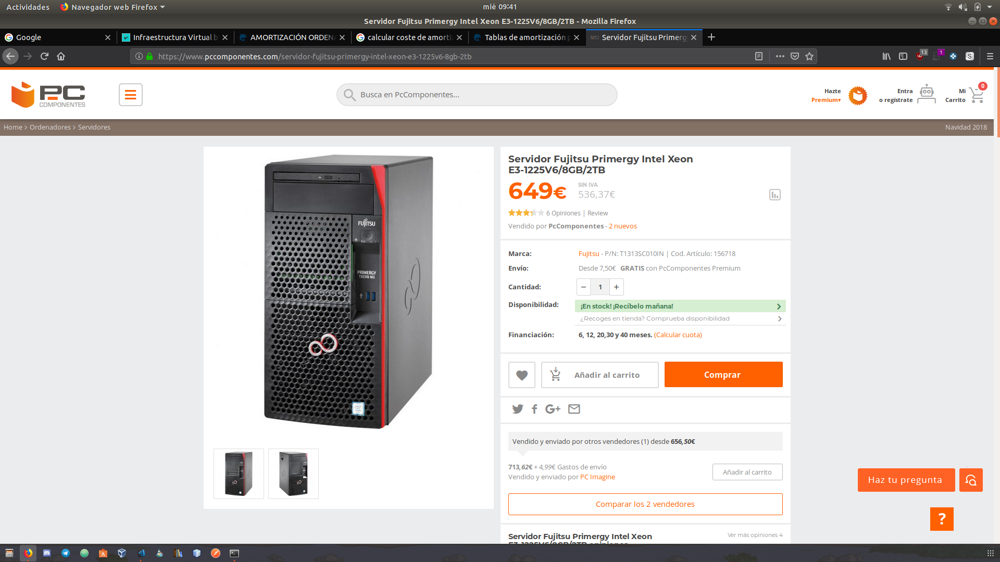

## Enunciado
Consultar en el catálogo de alguna tienda de informática el precio de un ordenador tipo servidor y calcular su coste de amortización a cuatro y siete años. Consultar este artículo en Infoautónomos sobre el tema.

### Solución

Hemos decidido comprar el siguiente servidor por valor de 649€. 

Suponiendo que la compra se realiza a comienzo de año, y teniendo en cuenta que podemos imputar un 25% del valor del mismo sin IVA, el amortizaje a 4 años sería:

- 1º año: 162.5€ 
- 2º año: 162.5€
- 3º año: 162.5€
- 4º año: 162.5€

En caso de que se calcule el coste de amortización en 7 años, el amortizaje del mismo sería del 15% aproximadamente cada año.

- 1º año: 97.5€ 
- 2º año: 97.5€ 
- 3º año: 97.5€ 
- 4º año: 97.5€ 
- 5º año: 97.5€  
- 6º año: 97.5€ 
- 7º año: 97.5€ 
