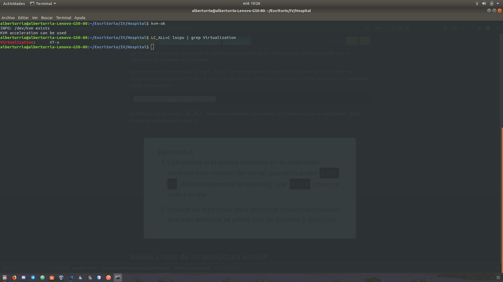
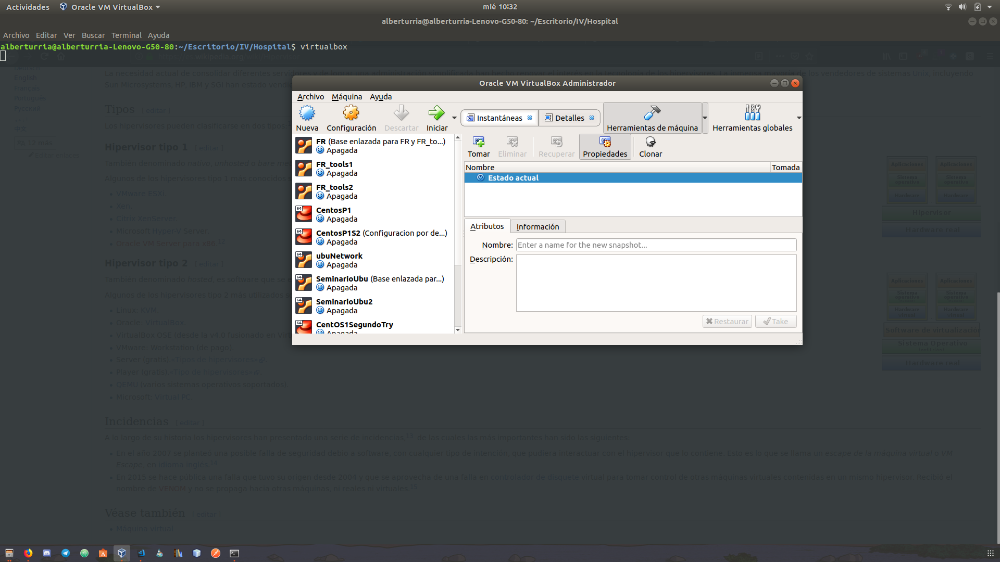

## Enunciado

1. Comprobar si el núcleo instalado en tu ordenador contiene este módulo del kernel usando la orden kvm-ok. Alternativamente (o además), usar lscpu como se indica arriba.
2. Instalar un hipervisor para gestionar máquinas virtuales, que más adelante se podrá usar en pruebas y ejercicios.

### Solución

1. Solución primera parte.

Lanzando ambos comandos podemos comprobar en primer lugar que mi ordenador tiene instalado el módulo de virtualización del kernel, y que la virtualización de mi ordenador se basa en la tecnología VT-x.

2. Solución segunda parte.

En mi caso no he instalado ninguno ya que ya tenía instalado OracleVirtualBox. 
Es un hipervisor de tipo 2, ya que se ejecuta sobre un Sistema Operativo.

