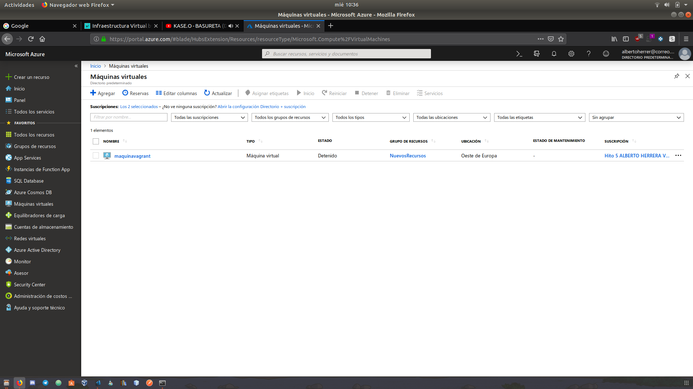

## Enunciado

Darse de alta en servicios de nube usando ofertas gratuitas o cupones que pueda proporcionar el profesor.

### Solución

En esta imagen se puede observar como ya me he dado de alta en el servicio Microsoft Azure. 
En la esquina superior derecha se aprecia mi correo electrónico de la universidad.

Se ha hecho uso de créditos ofrecidos por el profesor para poder hacer uso de dicho servicio.

