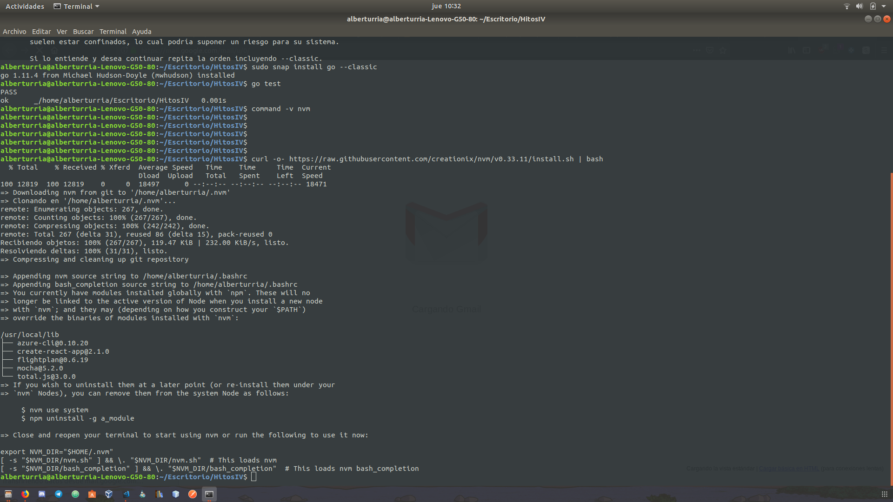

## Enunciado

Instalar alguno de los entornos virtuales de node.js (o de cualquier otro lenguaje con el que se esté familiarizado) y, con ellos, instalar la última versión existente, la versión minor más actual de la 4.x y lo mismo para la 0.11 o alguna impar (de desarrollo).

### Solución

Para ello hemos ido al [Github de nvm](https://github.com/creationix/nvm) y vemos que para instalar nvm debemos de escribir:
`curl -o- https://raw.githubusercontent.com/creationix/nvm/v0.33.11/install.sh | bash`

