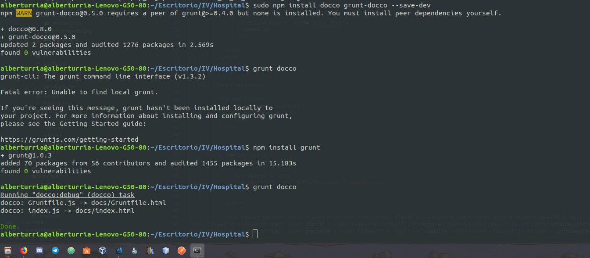
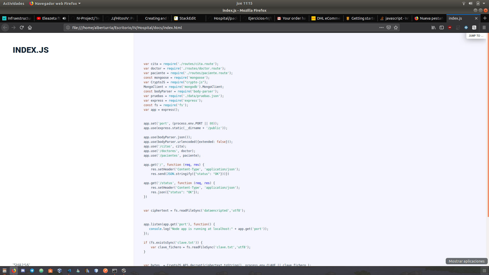

## Enunciado

Automatizar con grunt, gulp u otra herramienta de gestión de tareas en Node la generación de documentación de la librería que se cree usando docco u otro sistema similar de generación de documentación. Previamente, por supuesto, habrá que documentar tal librería.

### Solución

Tras instalar las dependencias de `grunt` y `docco` en mi proyecto se ha ejecutado `grunt docco` y se ha generado una nueva documentación en el documento `index.html`.

Aquí se puede ver cómo es el documento generado por docco:

