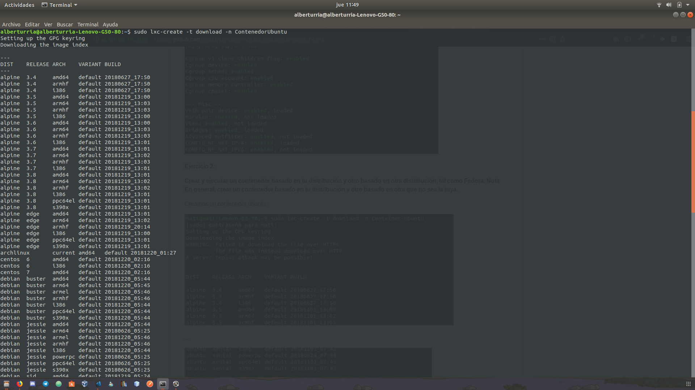

## Enunciado

Crear y ejecutar un contenedor basado en tu distribución y otro basado en otra distribución, tal como Fedora. Nota En general, crear un contenedor basado en tu distribución y otro basado en otra que no sea la tuya.

### Solución

Hemos creado y lanzado contenedores de Ubuntu y Gentoo.

Aquí se puede ver el proceso realizado en el caso del contenedor de Ubuntu.

